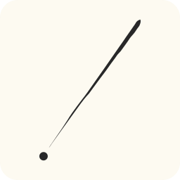

<p align="center">
  
</p>

<h1 align="center">Takt</h1>

<p align="center">
  A desktop widget for monitoring Claude Code and Codex usage on Windows.
</p>

---

## About

**Takt** is a lightweight Electron desktop widget that tracks your [Claude Code](https://claude.ai) and [Codex](https://chatgpt.com) API usage limits and token consumption in real time.

The name *Takt* comes from the German word for "beat" or "rhythm" — like a conductor's baton keeping time, Takt helps you stay in rhythm with your usage pace and avoid hitting rate limits unexpectedly.

## Features

- **Usage Tracking** — Monitor 5-hour and weekly usage quotas for Claude Code and Codex via donut charts with status-colored indicators (green / yellow / red)
- **Token Usage** — View daily, weekly, and monthly token consumption and costs via [ccusage](https://github.com/ryoppippi/ccusage)
- **Heatmap** — GitHub Contributions-style heatmap visualization of token usage history
- **System Tray** — Quick-glance usage info from the system tray with right-click menu controls
- **Settings** — Configurable refresh intervals, notification thresholds, provider selection, and more
- **Always on Top** — Optional always-on-top mode for persistent desktop visibility
- **Dark Theme** — Clean, compact dark UI designed for minimal screen footprint

## Tech Stack

- [Electron](https://www.electronjs.org/) + [React 19](https://react.dev/) + [TypeScript](https://www.typescriptlang.org/)
- [Tailwind CSS v4](https://tailwindcss.com/)
- [Zustand](https://zustand-demo.pmnd.rs/) for state management
- [Vite](https://vite.dev/) for bundling
- [bun](https://bun.sh/) as the package manager

## Getting Started

### Prerequisites

- [Node.js](https://nodejs.org/) (v18+)
- [bun](https://bun.sh/)

### Install

```bash
bun install
```

### Development

```bash
bun run dev
```

### Build & Package

```bash
bun run package
```

This generates Windows installers (NSIS + portable) in the `release/` directory.

## How It Works

Takt authenticates via persistent Electron sessions to fetch usage data directly from the Claude and Codex web APIs. Token usage statistics are collected through the [ccusage](https://github.com/ryoppippi/ccusage) CLI. All data is stored locally in `%APPDATA%/Takt/`.

## Acknowledgements

Takt was heavily inspired by [**AgentLimits**](https://github.com/Nihondo/AgentLimits) by [@Nihondo](https://github.com/Nihondo) — a beautifully crafted macOS menu bar widget for monitoring Claude Code usage built with Swift and WidgetKit. Takt aims to bring a similar experience to Windows users using web technologies. Huge thanks to the AgentLimits project for the original idea and design inspiration.

## License

[MIT](LICENSE)
