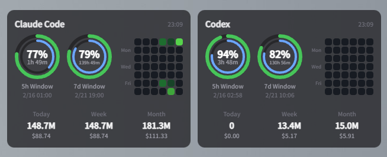

<p align="center">
  
</p>

<h1 align="center">Takt</h1>

<p align="center">
  A desktop widget for monitoring Claude Code and Codex usage on Windows.
</p>

---

## About

**Takt** is a lightweight Electron desktop widget that tracks your [Claude Code](https://claude.ai) and [Codex](https://chatgpt.com) API usage limits and token consumption in real time.

The name *Takt* comes from the German word for "beat" or "rhythm" — like a conductor's baton keeping time, Takt helps you stay in rhythm with your usage pace and avoid hitting rate limits unexpectedly.

## Features

### Usage Tracking

Monitor 5-hour and weekly usage quotas for Claude Code and Codex. Usage is visualized as dual-ring donut charts — the outer ring shows quota consumption and the inner ring shows elapsed time within the current window. Status colors (green / yellow / red) change based on configurable thresholds, and you can toggle between "Used" and "Remaining" display modes.

<p align="center">
  
</p>

### Token Usage

View daily, weekly, and monthly token consumption and costs via [ccusage](https://github.com/ryoppippi/ccusage). Supports both Claude Code (`ccusage`) and Codex (`@ccusage/codex`) independently.

### Heatmap

GitHub Contributions-style heatmap visualization of token usage history. Shows a 5-week rolling view with 5-level color intensity based on quartile distribution. Hover over any cell to see the date and token count.

### Window Attachment

Snap the widget to any application window (terminal, editor, etc.) so it follows the target as you move or resize it. When attached, Takt automatically switches to a compact **MiniView** showing mini donut charts.

<p align="center">
  
</p>

- **Target selection** — Pick the current foreground window or browse for an executable
- **Anchor position** — Attach to any of the four corners of the target window
- **Offset adjustment** — Fine-tune placement with Ctrl+drag in MiniView
- **Resize** — Ctrl+resize from edges opposite to the anchor corner
- **Responsiveness presets** — Fast, Normal, or Efficient polling intervals to balance responsiveness vs. CPU usage
- **Auto re-attach** — If manually detached, automatically re-attaches when the target window regains foreground focus
- **Double-click to detach** — Quick detach from MiniView

### Layout Options

- **Vertical / Horizontal** — Stack providers vertically or display them side by side
- **Transparent When Inactive** — Background fades when the window loses focus, with configurable opacity
- **Always on Top** — Keep the widget visible above other windows

### System Tray

Takt lives in the system tray with a right-click menu providing quick access to:

- Show / Hide the widget
- Refresh Now
- Always on Top toggle
- Attach / Detach from target window
- Settings
- Quit

### Settings

- **Provider selection** — Enable/disable Claude Code and Codex independently
- **Display mode** — Used vs. Remaining
- **Layout** — Vertical or Horizontal
- **Refresh interval** — 1 to 10 minutes
- **Status color thresholds** — Warning and danger percentages per provider and per window type
- **Custom status colors** — Override the default green / yellow / red
- **Background opacity** — 0–100% when transparent mode is active
- **Launch at Login** — Start Takt automatically with Windows
- **CLI paths** — Custom paths for npx, claude, and codex executables
- **Window attach** — Target process, anchor, responsiveness, offset, and layout reset

### Dark Theme

Clean, compact dark UI designed for minimal screen footprint. Frameless transparent window with no taskbar entry.

## Tech Stack

- [Electron](https://www.electronjs.org/) + [React 19](https://react.dev/) + [TypeScript](https://www.typescriptlang.org/)
- [Tailwind CSS v4](https://tailwindcss.com/)
- [Zustand](https://zustand-demo.pmnd.rs/) for state management
- [Vite](https://vite.dev/) for bundling
- [bun](https://bun.sh/) as the package manager

## Getting Started

### Prerequisites

- [Node.js](https://nodejs.org/) (v18+)
- [bun](https://bun.sh/)

### Install

```bash
bun install
```

### Development

```bash
bun run dev
```

### Build & Package

```bash
bun run package
```

This generates Windows installers (NSIS + portable) in the `release/` directory.

## How It Works

Takt authenticates via persistent Electron sessions to fetch usage data directly from the Claude and Codex web APIs. Token usage statistics are collected through the [ccusage](https://github.com/ryoppippi/ccusage) CLI. All data is stored locally — in `%APPDATA%/Takt/` for installed builds or `{exe_dir}/takt-data/` for the portable version.

## Acknowledgements

Takt was heavily inspired by [**AgentLimits**](https://github.com/Nihondo/AgentLimits) by [@Nihondo](https://github.com/Nihondo) — a beautifully crafted macOS menu bar widget for monitoring Claude Code usage built with Swift and WidgetKit. Takt aims to bring a similar experience to Windows users using web technologies. Huge thanks to the AgentLimits project for the original idea and design inspiration.

## License

[MIT](LICENSE)
